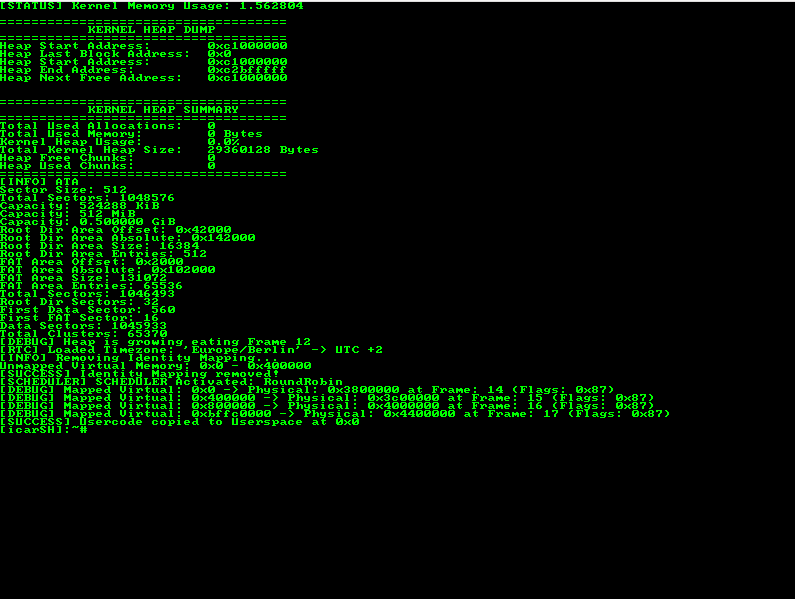

# icariusOS

A 🗿 yet 🪶 **Kernel**

[](https://opensource.org/licenses/MIT)


> Minimal. Monolithic. Handcrafted

 🆕 **Note:**  
ICARIUSOS AS A 64-BIT KERNEL IS BORN 🚀

BUILT ALONGSIDE CLASSIC ICARIUSOS — BOTH FLY TOGETHER. 🛠️🪶

---



## ✨ Features x86

### Architecture & Memory
- ✅ **HIGHER-HALF KERNEL**: Mapping at `0xC0000000`
- ✅ **PAGES**: 4 MiB Paging via **Page Size Extension (PSE)** 🔥
- ✅ **MEMORY ISOLATION**: User and Kernel **FULLY SEPARATED** using **CR3 Task Switching**
- ✅ **RING 3 TASKS**: Each Task has its **own Page Directory**

### Tasking & Scheduling
- ✅ **ROUND-ROBIN**: Custom Task Queue 
- ✅ **PREEMPTIVE**: Scheduler fires **AUTOMATICALLY** via `IRQ0 → scheduler_schedule()`
- ✅ **SYSCALL**: User Requests via `int 0x80`
- ✅ **STACK**: Supports up to **16 THREADS per Userspace Task** 

### Memory Management
- ✅ **KERNEL HEAP**: Chunking, Coalescing & **Detailed Stats**
- ✅ **USERSPACE ALLOCATOR**: Dynamic `malloc()` & `calloc()` (**NO MORE Bump Allocator!**)
- ✅ **PAGE FAULT HANDLER**: Diagnostics and Register Dumps

### 🖥️ Userspace Support
- ✅ **FULL USERSPACE ISOLATION**: 4 MiB for **CODE**, **BSS**, **HEAP**, **STACK** 
- ✅ **icarSH**:  
  `ls`, `cat`, `echo`, `exit`, `help`, `history`
- ✅ **USER HEAP SUPPORT**: Best-Fit Allocator

## 🧩 INSTALL DEPENDENCIES

- ✅ DEBIAN or WINDOWS via WSL
- ✅ Emulator

```bash
sudo ./scripts/build/dependencies.sh
```
- ✅ CROSS-COMPILER
```bash
./scripts/build/x86/gcc.sh
```
- ⚠️ NOTE: ALWAYS RUN SCRIPTS FROM THE PROJECT ROOT DIR  

## 🛠️ BUILD

```bash
./scripts/build/x86/build.sh && ./scripts/build/x86/icarsh.sh
```

## 🔁 SWAP AND RUN

Replace the Kernel Binary in your FAT16 Disk Image with a new BUILD and RUN IT.

```bash
./scripts/build/x86/swap.sh && qemu-system-i386 -m 4G -drive format=raw,file=./ICARIUS.img
```

## 🧠 KERNEL DEBUG

```bash
./scripts/build/x86/swap.sh && qemu-system-i386 -m 4G -s -S ./ICARIUS.img
gdb -x ./.gdbinit ./bin/ICARIUS.BIN
```

## 🔍 USERSPACE DEBUG

```bash
./scripts/build/x86/swap.sh && qemu-system-i386 -m 4G -s -S ./ICARIUS.img
gdb -x ./.gdbinit ./bin/ICARIUS.BIN
break *0x0
```

## 🌲 PROJECT DIR

```bash
tree | xclip -selection clipboard
```

## UEFI

```bash
cp /usr/share/OVMF/OVMF_CODE_4M.fd ./OVMF_CODE.fd
```

## ICARIUS64

```bash
qemu-system-x86_64 -drive file=ICARIUS.img,format=raw
```

## ICARIUS64 Debug

```bash
qemu-system-x86_64 -drive format=raw,file=ICARIUS.img -s -S
gdb -x ./.gdbinit64 ./bin/x86_64/ICARIUS.elf
```